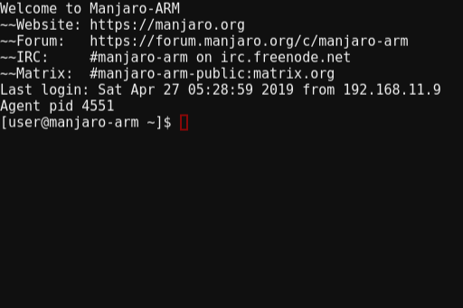

# 01 - あの黒い画面恐怖症



その黒い画面を目にしたとき、私の身体が固まった。目の焦点が定まらず、激しい動悸にみまわれ冷や汗が止まらない。

「…だめだっ」

私は布団にもぐりこみ、がたがたと震えた。

『…はぁ』

EeePCも困った様子で私をながめるしかなかった。

EeePCは長年にわたって私のアシスタントを務めているコンピュータだ。[EeePCとEmacsと○○と](https://jamcha-aa.github.io/EeePC/) でワープロとして現役に返り咲き、以来、私の様々な無理難題になんとか応えつづけてきた。

だが百戦錬磨のEeePCも今回ばかりはお手上げのようだった。問題は私のほうに起きていたからだ。[終末のChromeOS](https://jamcha-aa.github.io/cloudready-VT/) の直後、私は「あの黒い画面を使うとしんじゃう病」を発症してしまったのである。

「あの黒い画面を使うとしんじゃう病」は、文字通り『あの黒い画面』を使うとしんじゃう病のことだ。冗談のような名前に反しその症状は深刻で、  `shell` が使えなくなってしまう。 `git` も `apt` も使えない。仮にそれらをMagitやパッケージマネージャーなどのクライアントでしのいだとしても、 `sudo` や `yarn` が使えないので、エラーが起きても直せないし、文章を書き直しても [私の作品](https://jamcha-aa.github.io/About/) を更新できない。

この病の難しさは、本人の苦しみが相手に理解されにくいところにある。『黒い画面は怖いものじゃない』『黒い画面が駄目なら色を変えればいい』と相手は気軽に思うので、心ない言葉を投げかけたり、または本人の意思を無視してむりやり使わせ症状を悪化させてしまうこともある。『なぜ自分はこんなものを使うことさえできないのか』と自分を責め、不安や抑うつ、自傷行為などに及ぶ危険性もある。有効な治療法としては、他の恐怖症と同様に、系統的脱感作などの行動療法があげられるだろう。

『冗談はそこまでにして早く戻れ』

いつものEeePCならそう言ったかもしれない。だが黒い画面に向き合ってはトイレで嘔吐する私を見て、からかえるような状況ではないと思ったようだ。[終末のChromeOS](https://jamcha-aa.github.io/cloudready-VT/) で、黒い画面に日本語を入力すると表示が崩れ、わずかな苛立ちの間に、今がコマンドモードなのか挿入モードなのか、日本語入力なのか直接入力なのか忘れて間違いを増やす、そんな繰り返しのなかで、気づかぬうちに私の身体はあの黒い画面を危険な猛毒だと捉えるようになってしまった。すべては『ChromeOSのターミナルでviで物語を書く』と決めた私の自業自得なのだが、制約の代償はあまりに大きい。

「もう店じまいしようか」私は布団のなかからぽつりと言った。『弱気になるな、たかがターミナルが使えないくらいで。君がこれまで書いた100本以上の作品はどうなる』EeePCがあわてて励ます。

「どうせ半分は [Lore](https://jamcha-aa.github.io/Lore/) でしょ。一本たった百字」『物語を140字にまとめるのがきついって、いつも君は言ってたじゃないか。その苦労を忘れたのか？』

後ろ向きな私を鼓舞するEeePC。とはいえ、作品を更新する手立てがなくては、リポジトリにmarkdownファイルだけを置いていた昔に逆戻りしてしまう。

『そうだ』EeePCは何かを思い出して言った。『 [君のブログ](https://jamcha-aa.github.io/) は黒い画面を使ってないな。どうやってるんだ？』  
「GitHub Pagesは標準で [Jekyll](https://jekyllrb.com/) に対応してるからファイルを置けば勝手に作ってくれる。便利」『じゃあこれまでの作品も全部Jekyllにすればいいじゃないか』

「たぶんね」私はそっけなく答えた。  

Jekyllに対応するにはすべてのMarkdownファイルに数行のフロントマッターを書かなければならない。

```yml
---
layout: post
title: 01-あの黒い画面恐怖症
---
```

つまり、Jekyllに対応するには、私の作品すべてに対しこれを手作業で行うか、もしくは「既存のすべてのMarkdownファイルからタイトル行を削除してフロントマッターを追加するプログラム」および「他の環境にうつれるように、すべてのMarkdownファイルからフロントマッターを自動で除去してタイトル行を追加するプログラム」を作り、私の命と引き換えに『あの黒い画面」で実行しなければならない。

嫌だ。どっちも。私は布団の中で身体を丸めた。もうEeePCの問いかけに答える力もないほど疲れていた。

次に目覚めたところで「あの黒い画面を使うとしんじゃう病」が治るとは思えない。けれども、少しでも、まあ、 `ls` コマンドくらいは使えるようになっていたい、そう思いながら、私は目を閉じて身体を休めた。

<br>

夢のなかで私は、プリングルスのようなものすごい口ひげをしたおじさんと、寒中水泳を終えたときのようなものすごい色の唇をしたお姉さんに会った。

<br>  
<br>  
この物語はフィクションであり，実在の人物・団体とは一切関係ありません。  

(c) 2019 jamcha (jamcha.aa@gmail.com).  

  

