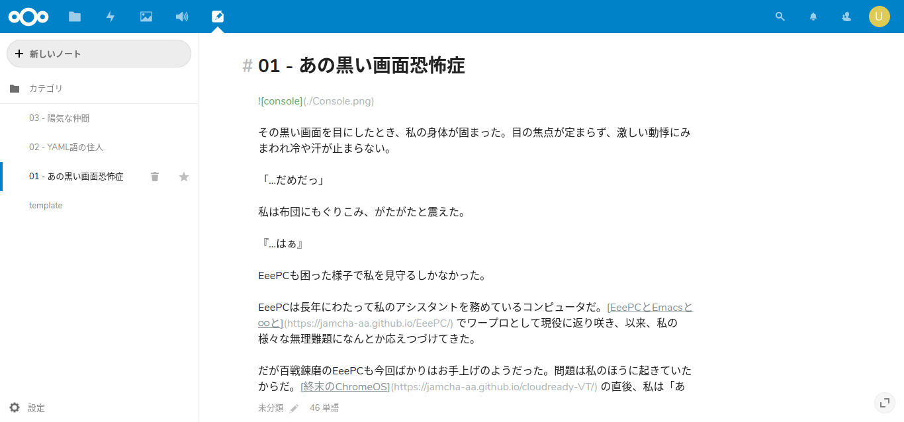

# 03 - 目覚めとおまけ: Nextcloud Notes

『それで、夢の中で私を勝手に壊したわけか』

音楽を流しながらEeePCがあきれている。私はムッとした。「勝手にじゃないよ。私がThinkPadを持っていたから辻褄を合わせるために世界が再構築されたんだ。そもそも君のバッテリーが持たないのがいけないんでしょ」  

EeePCも言い返す。『10年以上も支え続けた相手に言うことか、それ？』「支えてるのは私のほうだよ。ポンコツのくせに。わかってるのAtom第一世代！」『言葉に困ったらすぐ私のスペック叩きか。相手が言い返せないからって、そうやって侮辱して満足か。大した身分だな』「大した身分だよ！君のためにわざわざCI (継続的インテグレーション) の勉強したんだからさ！」

『私のために…？』「あー、いや…」赤くなってEeePCから目をそらす私。言葉の応酬が止み、ピアノのかすかな音色とThinkPadの排気だけが部屋に響く。

ごまかすように私が言う。「え、えっと、作品を更新するときにさ、[VuePress](https://vuepress.vuejs.org/) とか [mdBook](https://rust-lang-nursery.github.io/mdBook/) とかさ、ThinkPadだったらすぐにデプロイできるんだけど、君だと時間かかるから、代わりにやってくれる人がいると便利だなって…調べてたん…で…す」

『…』「ChromeOSも触り始めたし…いまはターミナルも使えないし…ちょうどいいかな…って…ね、ねえ、黙ってないでさ、なんかしゃべってよ…」

『アップデートが8件あります。更新しますか？』ThinkPadが機械的に言った。

ど、っと空気の糸が切れる。「うー」へなへなと力なく机に突っ伏しながら、私はThinkPadの言うままにパッケージを更新するよう指示した。

## Nextcloud Notes

「Travisは次からがんばるとして、私のファイル置き場『 [Nextcloud](https://nextcloud.com) 』には [Notes](https://github.com/nextcloud/notes) という便利なアプリがありして」『ありして』「あ・り・ま・し・て！」『うむ』「Markdown用のショートカットがあるのに本家のwikiには書かれてなかったのでここにまとめておきます」

|  ショートカットキー | 機能 |
| --- | --- |
|  Ctrl + i | 斜体 |
|  Ctrl + b | 太字 |
|  Ctrl + d | 一行削除 |
|  Ctrl + x | 一行削除 |
|  Ctrl + f | 検索 |
|  Ctrl + h | 見出し |
|  Ctrl + k | リンク |
|  Ctrl + l | 箇条書き (タブでネスト) |
|  Ctrl + ' | 引用 |
|  Ctrl + v | 空行挿入 |

表作成には [MarkdownTableMaker](https://chrome.google.com/webstore/detail/markdowntablemaker/cofkbgfmijanlcdooemafafokhhaeold) を使いました。

   
   
この物語はフィクションであり，実在の人物・団体とは一切関係ありません。  

(c) 2019 jamcha (jamcha.aa@gmail.com).  

  

