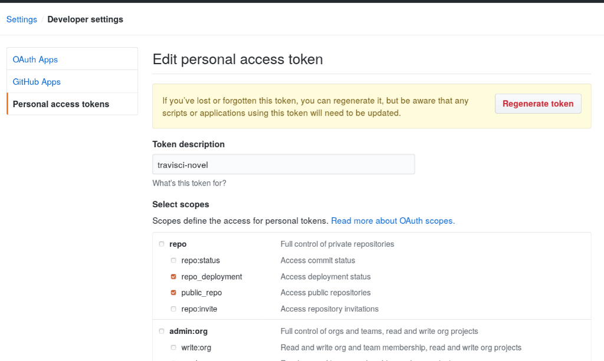
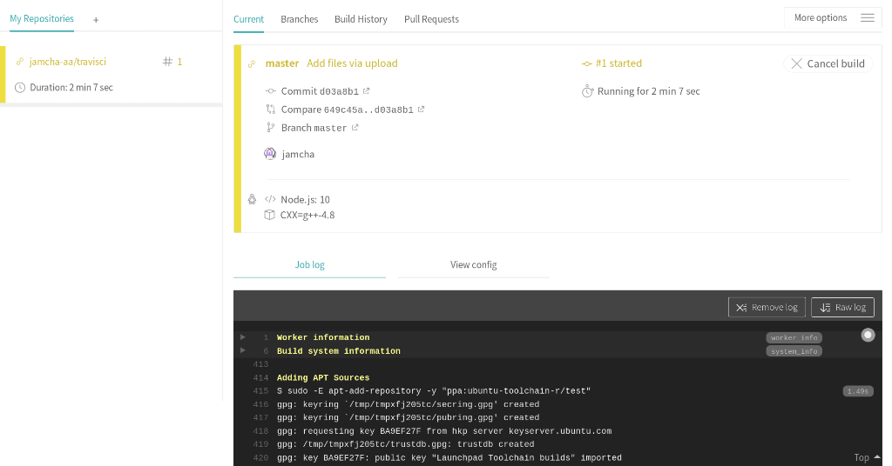

# 04 - 陽気な仲間

「CI (継続的インテグレーション) って開発手法を指すらしいんだけど、とりあえずここではCIを補助するサービスの話をします」  
『ああ』  
「パソコンで作業してるといずれ『あの黒い画面』を触るときが来ると思う。でもたいていの人は汚物を見るように避けるか、どうしてもやらなきゃいけないときはお金を払うか誰かの家族を人質にしてやらせてると思う」  
『殺伐としすぎだろ…』  
「したがって『あの黒い画面』を触らずに済む方法が必要で、その解決策のひとつとして私はCIサービスを提案します」  
『ほー』  
「CIサービスはどこまで『あの黒い画面』を肩代わりしてくれるのか、それを確かめたかったので、今回はこの作品を『あの黒い画面』を一切触らずに作ってみようと思いました」

- `.travis.yml` と `package.json` の原作者: 
	- [Publish a Vuepress site on GitHub pages with Travis](https://itnext.io/publish-a-vuepress-site-on-github-pages-with-travis-82036243bf36) by [Samuel Pouyt](https://itnext.io/@samuelpouyt)

- 参考にしたページ: 
	- [VuePressでGitHub Pagesにリッチなドキュメントを作る](https://qiita.com/uphy/items/26ea2862b75c6c6e703d)
	- [Github + Vuepress + Travis-CI](https://alvinmi.github.io/2019/03/22/Github+Vuepress+Travis-CI%E6%8C%81%E7%BB%AD%E9%9B%86%E6%88%90.html)

## 下準備

「今回は『あの黒い画面』での作業を [Travis CI](https://travis-ci.org/) にお願いしました。理由はTravisおじさんがプリングルズみたいなものすごいひげで、あともう一人いるんだけどその人の唇が寒中水泳の…」  
『マスコットのインパクトにやられたんだな。まったく君は、 [Docusaurus](https://docusaurus.io/) の恐竜といい、そういう…』  
「恐竜じゃなくて 『[Slash](https://docusaurus.io/en/about-slash)』 だよ、『Slash』。君さ、失礼じゃない？友達とか家族のこと『人間』なんて呼ぶ？呼ばないでしょ？」  
『…』「Slash。聞こえた？」  
『ああ。…(ひげをからかうのは失礼じゃないのか？)』  
「からかってるんじゃなくてひげがすごいって言ってるだけなんだけど！？」『あ、ああ。そうだな…何か、からかうより失礼だと思うんだが…』

<br>

「基本的なファイル構成はふだん私が使っているテンプレートから引っ張ってきて、 `.travis.yml` と `package.json` だけ追加した感じ」

```sh
$ tree -al -I ".git"
.
├── .gitignore
├── .nojekyll
├── .travis.yml
├── .vuepress
│   ├── config.js
│   ├── public
│   │   ├── hero.png
│   │   └── img
│   │       └── favicon.png
│   ├── styles
│   │   └── palette.styl
│   └── summary.js
├── README.md
├── article
│   ├── 01.md
│   └── 01.org
└── package.json
```

「 `package.json` は引用元そのままで、」

```json
{
    "scripts": {
        "docs:dev": "vuepress dev docs",
        "docs:build": "vuepress build docs"
    }
}
```

「 `.travis.yml` は私の環境にあわせてちょっといじった」

```yaml
language: node_js
node_js:
    - "10"
env:
    - CXX=g++-4.8

addons:
    apt:
        sources:
            - ubuntu-toolchain-r-test
        packages:
            - g++-4.8
install:
    - npm install -g vuepress@next
script:
    - npm run docs:build
cache:
    directories:
        - "node_modules"
notifications:
    email: false
deploy:
    provider: pages
    skip-cleanup: true
    local_dir: /.vuepress/dist
    github-token: $GITHUB_TOKEN  # Set in the settings page of your repository, as a secure variable
    repo: jamcha-aa/travisci
    keep-history: true
    target-branch: master
    on:
        branch: master
```

## GitHubトークン

「それじゃあ早速動かしてみようか」『もう動かせるのか』「あと少しね。 [Travis CI](https://travis-ci.com/) にGitHubアカウントでログインすると、リポジトリの一覧が表示されます。リポジトリ名の隣にあるスイッチを切り替えて、Settingsをクリックすると下のあたりに『トークン取ってこい』と書かれているので取りに行く」


「GitHubアカウントのSettingを選んで一番下にある `Developer settings` を選択」


「 `Personal access tokens` → `Generate new tokens` を選択」


「トークンの名前と権限を決める。下の画像は一旦作ったあとにスクリーンショット撮ってるから警告画面が出てるけど、初めて作るときには出ない。Travisおじさんの権限は `repo_deployment` と `public_repo` くらいでいいかな」



「準備ができたら `Generate token` をクリックする。トークンが発行されるから、この文字列をTravisのSettings画面にある `Environment Variables` のパスワード欄にコピペする。 変数名は `GITHUB_TOKEN` で、それが済んだら `Add` をクリック。…あ！大事なこと忘れてた！」  
『ん？』  
「発行画面にも英語で書かれてるけど **トークンは一度しか表示されない** 」  
『一度だけか？』  
「そう。タブを閉じたらGitHubの設定画面を開いても再表示されない。それくらい漏れたら危険なもの。ペーストしたらすぐクリップボードの履歴も消しましょう」


備考: [Travis CIでGitHub Personal access tokensが漏れないようにする](https://efcl.info/2017/05/09/travis-ci-github-token/)

## Travisおじさん、起動


「ウオオオオオオオオオオオオオオオオオ！！」

『な、何だ突然！？』  



「YAML語の指示を解したTravisおじさんが仕事を開始しました。ログが流れていく様子がかっこいい。あとオープンソースプロジェクトなら、YAML語で話しかければTravisおじさんは無償のボランティアのように働いてくれます。健気すぎて涙が出てきそう」  
『そ、そうか…うーむ、だからって君が叫ぶ必要があるのか？それにさっきから言ってるYAML語って何だ？』  
「YAML語はTravisおじさん達が使う言語。 `.travis.yml` に書いてある言葉。単にYAMLとも言う」  
『YAML語って呼ぶ意味は？YAMLでいいだろう』  
「『TravisおじさんはYAML語じゃないとわからない』、って強く言わないと、手軽にタダで使える労働力だと勘違いするバカが出てくる」  
『おっと、言葉に気をつけろ。まったく、随分な言いようだな。たとえば？』  
「私とか」  
『…。うーん、どう言ったものやら…。…ほら、君が言ったとおり止まったぞ』


「それみたことか」  
『それみたことかって…YAML語とやらを書いたのは君だろ？』  
「そうですけど？」  
『開き直るのはいいから、原因は何だ』  
「これから調べるんですけど何か？」  
『…』


『どうだ？わかりそうか？』  
「たぶん…、あ、ディレクトリの場所が違ってたんだ」  
『YAML語の文法間違いってところか』  
「そうそう。Travisおじさんには正しい言葉遣いじゃないと通じないからね」


## Travisおじさん、指示どおりに `master` ブランチを灰燼に帰す


『今度は成功したようだな』  
「うん。…あれ？」  
『ん？どうした？』  
「 `master` ブランチの中身が全部消えてる」  
『へ？』  


『どういうことだ？成功したんだろ？』  
「うん。たぶん…むしろ、ちゃんと伝わっちゃったせいで全部消されたんだと思う」  
『意味がわからない』  
「わかれよ！！」

ドン！

『…』  
「…」  
『…すまない。ショックだったのは君だよな』  
「…こっちこそごめんね。はー…」

```yaml
    target-branch: master
```

「あー…そうか。私のYAML語は文法的にはあってて、でも仕事の結果を `master` ブランチに上書きするものになっちゃってたのか…」  
『直せそうか？』  
「原因はわかったよ。ここをこうすれば」

```yaml
    target-branch: gh-pages
```

「これでTravisおじさんは私のねらいどおりに働いてくれると思う」  
『じゃあやってみるか』  
「うん。 `revert` でGitコマンドを使わなきゃいけないから、当初の目的は失敗だけど、でもファイルのアップロードは全部GitHubの画面からやってるよ」  
『手間じゃないのか』  
「そりゃあもうものすごく面倒だよ」  
『だろうな…』  
「アップロードに失敗したり、気を抜くとすぐ `master` ブランチに戻るから間違えてアップロードしちゃったりして、やっぱブラウザの画面ておまけなんだなって思い知らされました」

## ハロー、Tessa

「 `.travis.yml` を修正して再挑戦だ！」

```yaml
language: node_js
node_js:
    - "10"
env:
    - CXX=g++-4.8

addons:
    apt:
        sources:
            - ubuntu-toolchain-r-test
        packages:
            - g++-4.8
install:
    - npm install -g vuepress@next
script:
    - npm run docs:build
cache:
    directories:
        - "node_modules"
notifications:
    email: false
deploy:
    provider: pages
    skip-cleanup: true
    local_dir: .vuepress/dist  # ビルドされたファイルが置かれる場所
    github-token: $GITHUB_TOKEN  # Set in the settings page of your repository, as a secure variable
    repo: jamcha-aa/travisci  # リポジトリ名
    keep-history: true
    target-branch: gh-pages  # 出力されるブランチ
    on:
        branch: master  # このブランチの中身がtarget-branchに出力される
```


(c) Travis CI, GmbH.

『おわっ！びっくりした！』  
「ん？」  
『なんだ今のは？Travisは一人じゃないのか！？』  
「え、Tessaのこと？」  
『Travisじゃないのか』  
「Travisはものすごいひげの方だよ。Tessaはかわいい方。唇がまるで寒中水泳…」  
『いや、いい。君の言いたいことはわかった』  
「でしょ。かわいいよね」  
『う、うーむ、君は…ま、まあ、それはともかく、結果はどうだ？』  
「これを見て」

## 成功の証

[](https://travis-ci.org/jamcha-aa/travisci)  

「GitHubでよく見るこのアイコンは飾りじゃなくて、ここにCIの作業結果が表示される」  
『passingということは成功したということか？』  
「そうそう。このバッジがあまりにもかっこよすぎて、どうしても表紙に飾りたいからこの企画を始めたといってもいい」  
『そ、そうか…。君にとっては飾りなんだな…。じゃあ、君の作品でこのアイコンを見たら、そこでTravisが働いていると考えていいんだな？』  
「そう！TravisおじさんとTessaお姉さんの活躍に乞うご期待！」

<br>
<br>

-- 了 --

<br>  
<br>  
(c) 2019 jamcha (jamcha.aa@gmail.com).  

  

